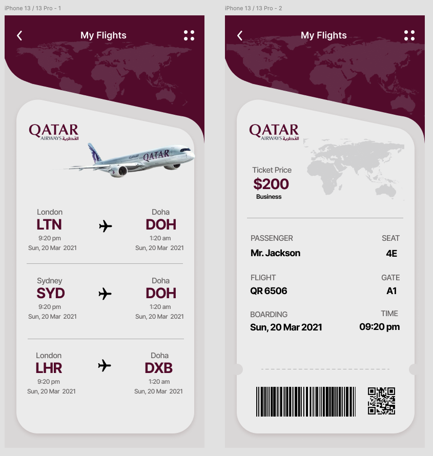

## Challenge 3: Boarding Pass

...

## Figma Designs

## Result

<iframe
  src="/challenges/boardingPass"
  height="844"
  width="100%"
  style="border:0;"
  allowfullscreen="allowfullscreen"
  loading="lazy"
  title="Boarding Pass Challenge"
></iframe>

...

## Learnings

...
